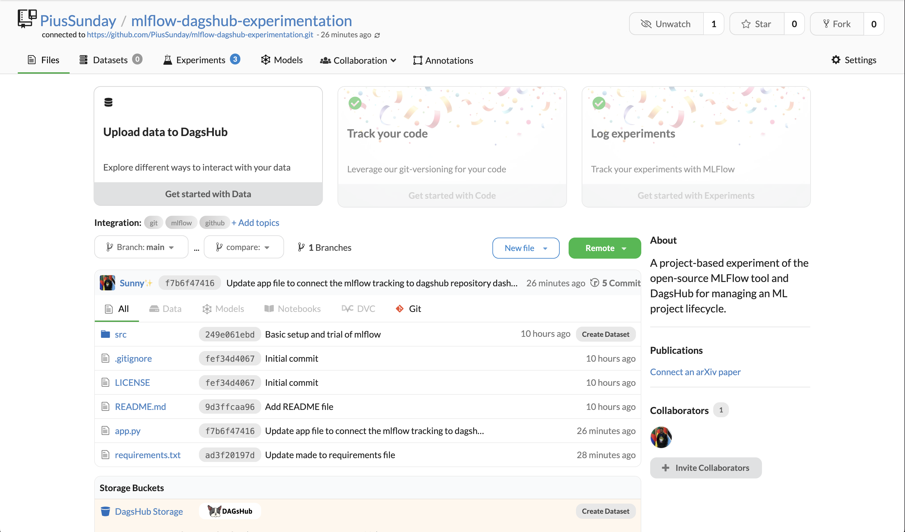
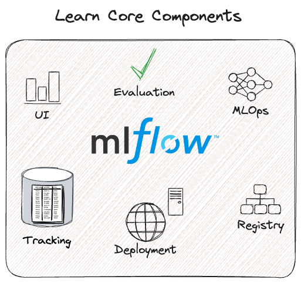

# MLflow and DagsHub Experiment Tracking

[](https://dagshub.com/PiusSunday/mlflow-dagshub-experimentation)

[](https://mlflow.org/docs/latest/index.html)

This repository demonstrates how to use MLflow and DagsHub for tracking machine learning experiments, specifically training an ElasticNet regression model on the Wine Quality dataset.

## Overview

This project showcases:

* **MLflow:**
  * Tracking experiment parameters, metrics, and models.
  * Using the MLflow Model Registry to manage trained models.
  * Leveraging MLflow's automatic signature inference via input examples.
* **DagsHub:**
  * Utilizing DagsHub as a remote MLflow tracking server.
  * Viewing experiment results and model versions in the DagsHub UI.
  * Using DagsHub to easily visualize and reproduce ML experiments.

## Getting Started

### Prerequisites

* Python 3.10+
* `pip install -r requirements.txt`
* An MLflow server running locally or remotely.
* A GitHub repository for the project and a DagsHub account linked to the repository in order to track experiments.

### Setup

1. **Clone the repository:**

    ```bash
    git clone https://github.com/PiusSunday/mlflow-dagshub-experimentation.git
    cd mlflow-dagshub-experimentation
    ```

2. **Create and activate a virtual environment (recommended):**

    * **For macOS/Linux:**

        ```bash
        python3 -m venv "venv-name"
        source venv-name/bin/activate
        ```

    * **For Windows:**

        ```bash
        python -m venv "venv-name"
        venv-name\Scripts\activate
        ```

3. **Install dependencies from `requirements.txt`:**

    ```bash
    pip install -r requirements.txt
    ```

    * **Note:** Make sure you have a `requirements.txt` file in your repository's root directory. If you don't, create one by running `pip freeze > requirements.txt` after installing the necessary packages.

4. **Run the script:**

    ```bash
    python app.py [optional alpha] [optional l1_ratio]
    ```

    * Example: `python app.py 0.7 0.3`
    * If `alpha` and `l1_ratio` are not provided, default values (0.5, 0.5) will be used.

5. **View results on DagsHub:**
    * Navigate to your repository on DagsHub.
    * Go to the "Experiments" tab to see the MLflow runs.
    * Go to the "Models" tab to see the registered model.

6. **Deactivate the virtual environment when you are done:**

    ```bash
    deactivate
    ```

## Code Explanation

* `app.py`: Contains the Python script that trains the ElasticNet model, logs parameters and metrics to MLflow, and registers the model.
* The script uses the Wine Quality dataset from the MLflow repository.
* DagsHub is initialized to track MLflow experiments remotely.
* The model is logged with an input example to infer its signature, preventing warning messages.
* The script logs the model into the MLflow model registry.

## DagsHub and MLflow Resources

* [DagsHub Docs](https://dagshub.com/docs/integration_guide/mlflow_tracking/)
* [MLflow Documentation](https://mlflow.org/docs/latest/index.html)

## Contributing

Feel free to contribute to this project by submitting pull requests or opening issues.
